There are 2 important concepts in our platform:
- Creative asset group
- Template

A **creative asset group** (CAG) defines the shape of an ad, and a **template** defines how an ad look/render on a website.

### Creative Asset Groups

Before setting up your ad templates, you need to first define the shape of your ad. This means you need to look at your ad design and start sectioning that design into fields/slots.
For example, if you have an ad design that looks like this:

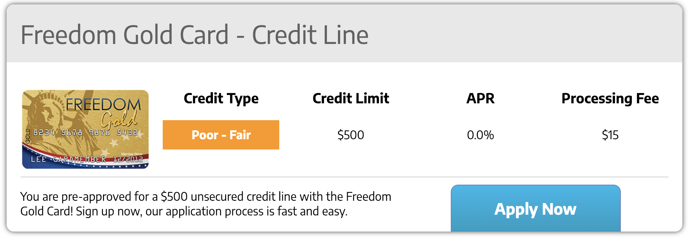

You might want to split the design into these informational sections:
- `headline` (for the text *"Freedom Gold Card - credit line"*)
- `creditType` (for the text *"Poor-Fair" with orange box"*)
- `creditLimit` (for the text *"$500"*)
...so on and so forth.

There is a special case for creative images, we will get to that in the next section.

After deciding those sections, you can start creating a **CAG**.
In the sidebar of our platform, click on `Creative asset groups`, which leads you to this page:

**In case you don't have any CAG:**
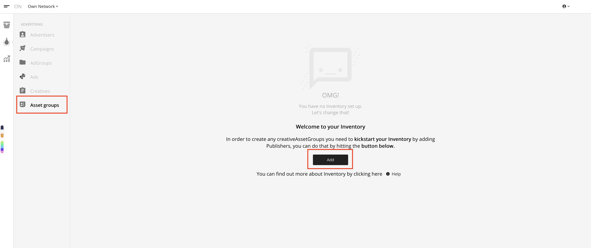

**In case you have existing CAGs:**
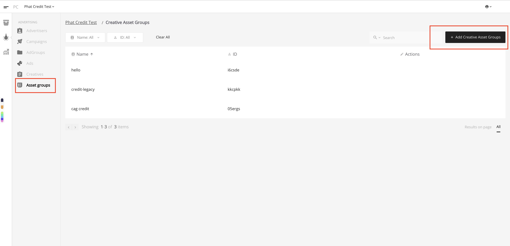

Look for the create buttons (red-highlighted in the images), which leads you to:
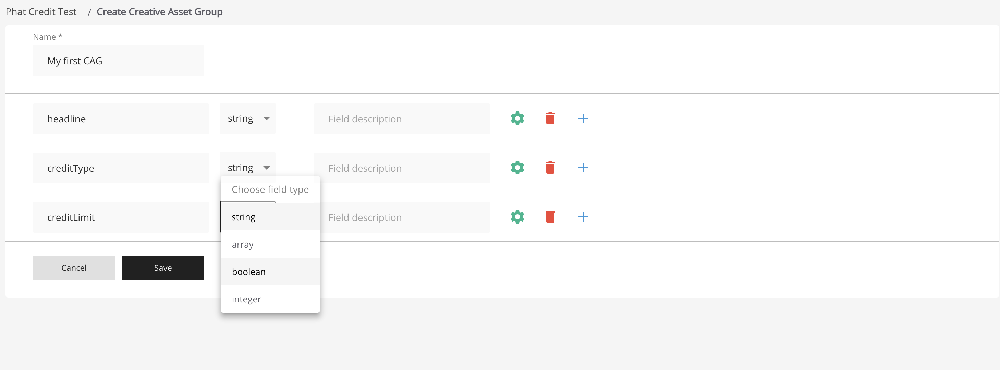

Give your CAG a meaningful name so that you can remember it to select for use later while setting up the rest of the system.
A valid name contains characters from `a-z`, `A-Z`, `1-9` and `_` character.
You can also add an optional description (will not be rendered in the ad) for each field in case you forgot what the field is about.

In this example CAG, I have set up 3 fields corresponding to our sections. You can see that we can choose to have 1 of 4 data types for a field:
- `string` - field will be a text or a paragraph
- `integer` - field will be a number
- `boolean` - field will have true/false value
- `array` - field will contain a list of values, useful when you need to render bullets list.

The `Array` data type, when selected, will let you choose what data type a member of a list should be.
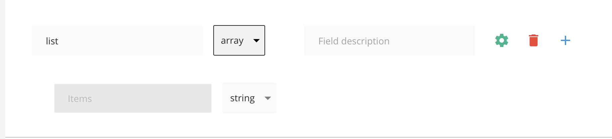

For each non-array field, you can specify that its value should only be within a number of predefined values, called `enum`. To edit an `enum` for a field, click on the **edit** icon.

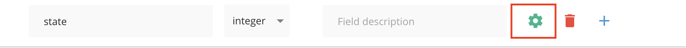

Then add your pre-defined values:

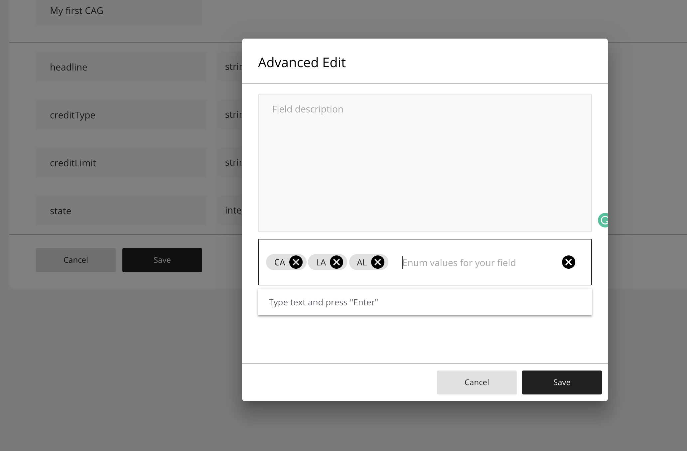

Let's save our first CAG!

### Templates

Before moving to the next step, let's make sure that you have your advertising and publishing branches set up, which includes:
- Publisher -> Channel -> Website -> Zone
- Advertiser -> Campaign -> AdGroup

It's time we create some templates!

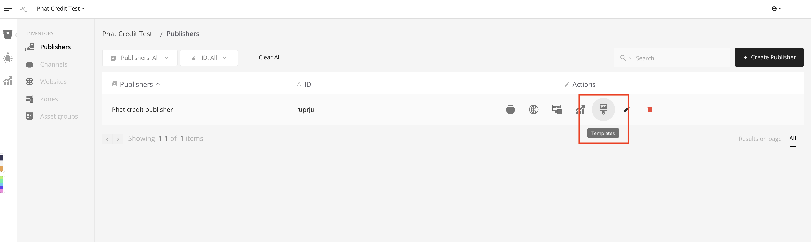

After selecting a CAG we want to apply into the template (`my first CAG` in the screenshot), a help button will appear to aid you to finish the template:
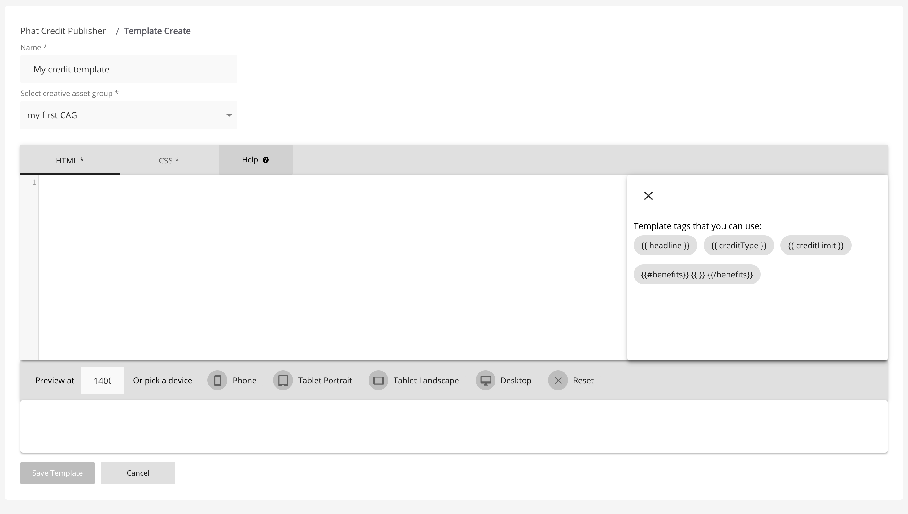

Those help tags is generated from our CAG, its special syntax will help us inserting the real ad contents from a **creative**, clicking on those help tags will let you paste the tag's content to our editor UI.

Let's write some HTML for our template:

```
<div>
header
{{#ads}}
  <div id="{{ adId }}">
    <h2>{{ headline }}</h2>
    <p>{{ creditType }}</p>
    <span>{{ creditLimit }}</span>
    <ul>
      {{#benefits}}
        <li>{{.}}</li>
      {{/benefits}}
    </ul>
  </div>
{{/ads}}
footer
</div>
```

### Notes:
- The pair of tags `{{#ads}}` and `{{/ads}}` is required to mark the start and the end of our ads section.
  The contents inside that pair of tags will be repeated for each ad if you have `data-ad-feed-count` larger than 1.

- `{{ adId }}` is a special tag to add id of an ad to our rendered HTML, when not given, it will be added automatically for each ad.

- For non-array fields, we simply need to add the name of the field around braces `{{ headline }}`, the ad's content will be inserted correctly.

- For array fields (in this example, it's `benefits`), we need the syntax used in ads section `{{#benefits}}{{.}}{{/benefits}}`

After adding HTML, let's add some CSS:

```
h2 {
  font-size: 24px;
}
```

Then save our template.

Go to your set up ad group, and select our CAG created in the previous steps, then save the ad group.

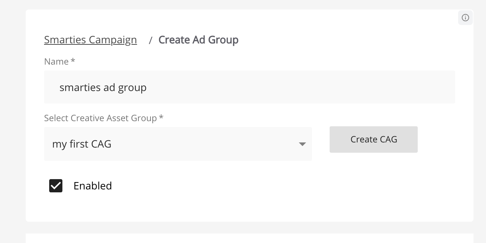

Next, let's create a creative.

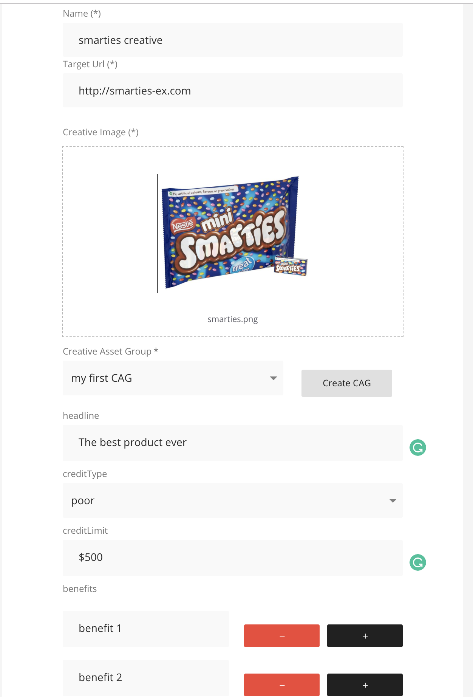

### Notes:
- The CAG fields will appear when you select a CAG, the values you enter will be inserted into a template accordingly. For example in our template we have `{{ headline }}`, and in the creative we have `headline = "The best product ever"`, after rendering, the ad will have that text.

Save the creative we just created.

Next, let's create an ad using our creative.

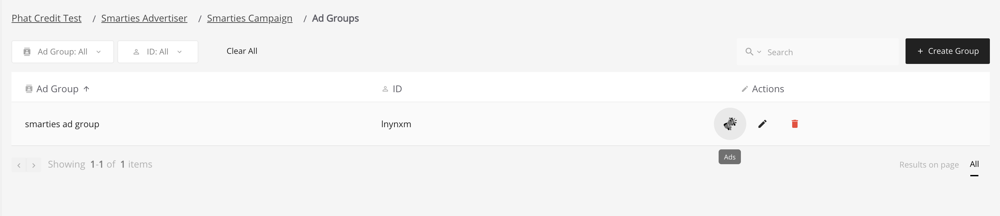
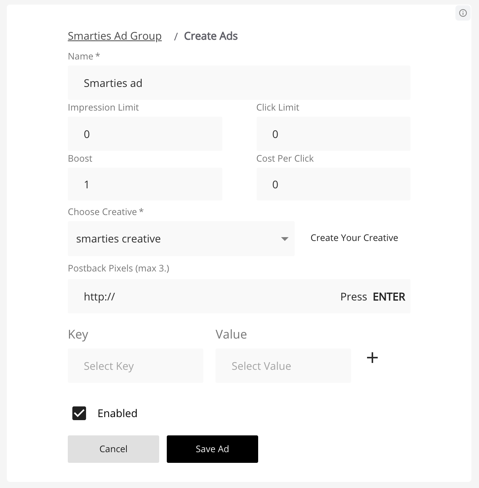

### Notes:
- Make sure you select the creative we just created and enable the ad before saving.

Congratulations! You have just finished setting up templates and ads, your ads will be automatically fetched and shown in the publisher's site when using the adverse script tag.
